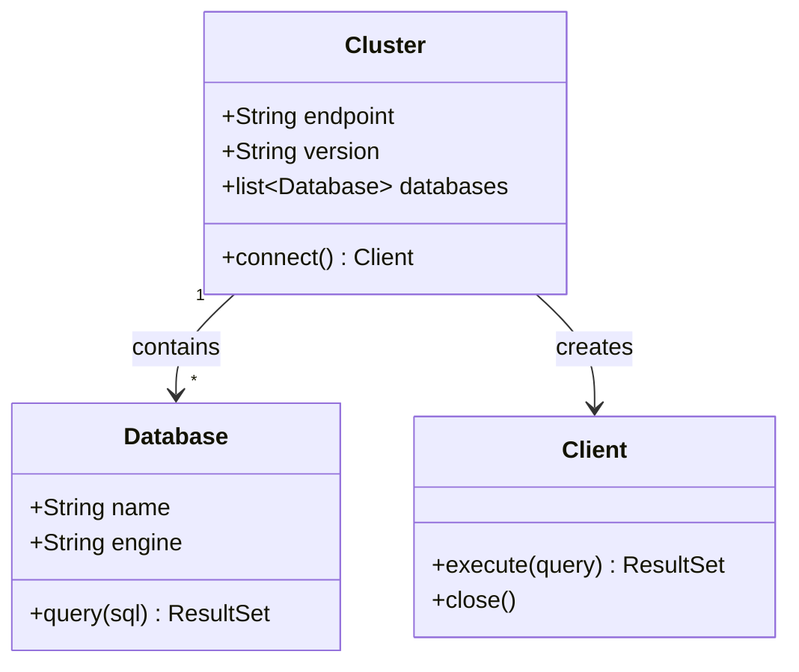
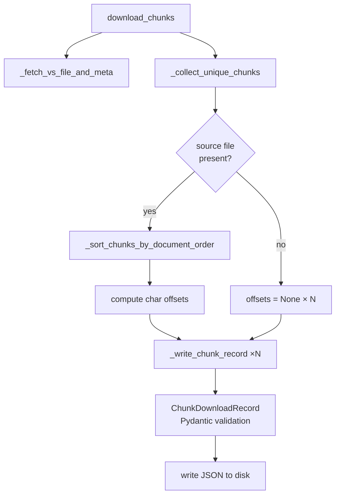
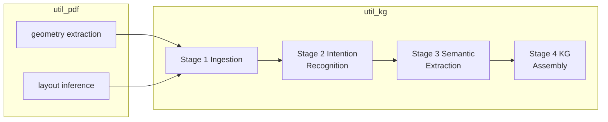
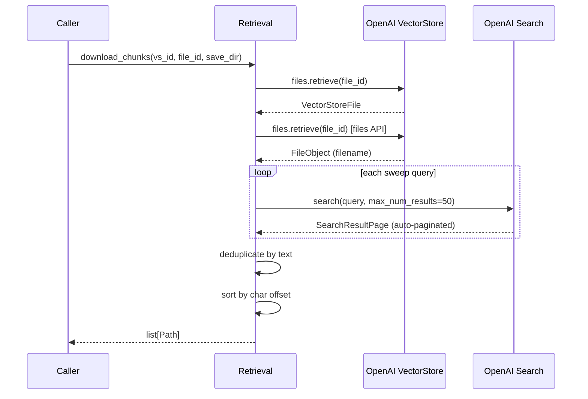
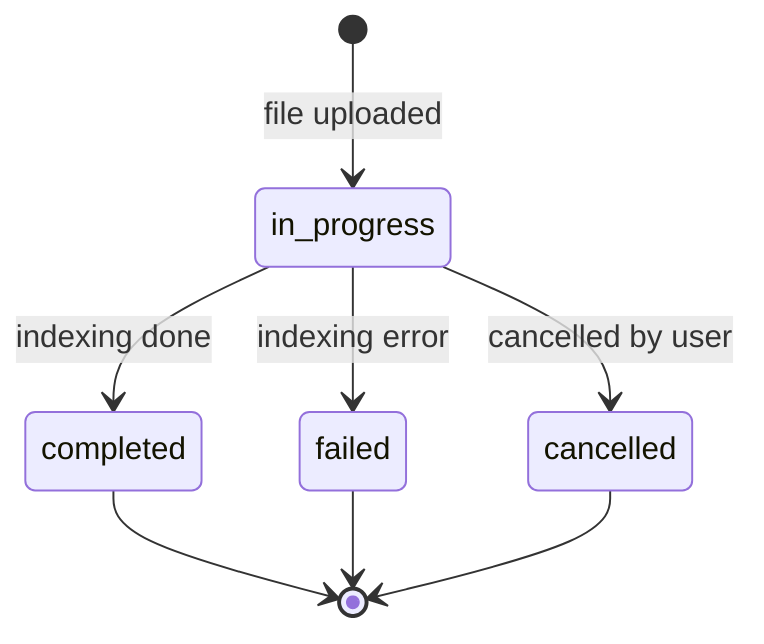
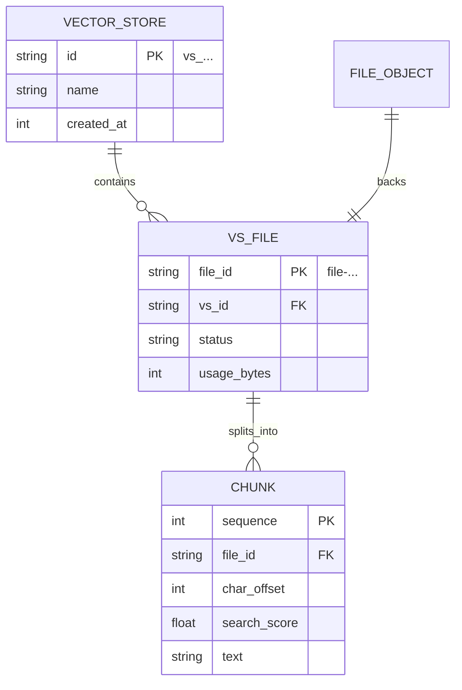

# Common Coding Standards

---

## Defensive Programming

Be defensive. Expect the unexpected.

Verify expectations and assumptions are true.

If a file is to be generated, verify it has been indeed generated.

---

## Code as Story: The Narrative Main

Programs communicate intent at two levels: the detail level (each line, each expression)
and the structure level (how the pieces compose into a whole). Most code fails at the
structure level — logic accumulates inline, the entry point becomes a wall of
implementation detail, and a new reader must trace every line to understand what
the program does.

The antidote is the **narrative main**.

### The Rule

**Every entry point — `main`, top-level script, public API function — must read as
a sequence of named steps. Each step is a call to a pure function with a single
responsibility. The main block is the table of contents. The functions are the
chapters.**

```python
def main():
    config  = load_config(args)
    data    = fetch_data(config)
    result  = process(data)
    save(result, config.output_path)
```

A reader who sees only this block should be able to state what the program does in
one sentence, find the function responsible for any behaviour without `grep`, and
replace any step without touching the others. No comment needed. The program is
its own specification.

### The AWK Model

AWK programs are the canonical example: a sequence of named operations on the input
stream, each rule self-contained. The top-level structure tells the whole story.

```awk
BEGIN  { initialise() }
/data/ { process($0)  }
END    { report()     }
```

Apply the same discipline in any language:

```python
# Good — reads like a story
records = read_records(path)
cleaned = clean(records)
grouped = group_by_key(cleaned)
write_report(grouped, output_path)
```

```python
# Bad — implementation masquerading as a program
with open(path) as f:
    for line in f:
        parts = line.strip().split(',')
        if parts[0] not in seen:
            seen.add(parts[0])
            groups.setdefault(parts[0], []).append(parts[1:])
with open(output_path, 'w') as f:
    for k, v in sorted(groups.items()):
        f.write(f"{k}: {v}\n")
```

The first is a program. The second is a sequence of mechanism with no visible structure.

### Pure Functions with Single Responsibility

Each function called from the narrative main must:

- **Do one thing** — its name is a verb phrase that fully describes the operation
- **Take inputs, return outputs** — no hidden state reads, no implicit side effects
- **Be testable in isolation** — same inputs always produce the same outputs

Side effects (I/O, network, database) are unavoidable. Isolate them at the boundary:
one function reads, one function writes. The logic in between is pure.

### Naming

Function names must be imperative verb phrases that name the operation, not the
implementation:

| Good                          | Bad                        |
|-------------------------------|----------------------------|
| `load_config(path)`           | `get_cfg(p)`               |
| `fetch_records(client)`       | `do_api_call(c)`           |
| `transform_to_schema(data)`   | `process(d)`               |
| `write_report(results, path)` | `output(r, p)`             |

### What This Achieves

| Property                             | How the narrative main delivers it                          |
|--------------------------------------|-------------------------------------------------------------|
| Self-documenting code                | The entry point is a readable description of the program    |
| Testability                          | Every step is independently exercisable                     |
| Replaceability                       | Swap any step without touching its neighbours               |
| Reviewability                        | A reviewer reads the main and understands scope instantly   |
| Diagrams that write themselves       | The call flow diagram is already in the main block          |

Documentation that lives in the code cannot go stale. A main that reads like a story
*is* the specification.

---

## Documentation

### Philosophy: Capture What the Author Had in Their Head

Code shows *what* the program does. It does not show *why the structure exists*, *what
the author was thinking*, or *how the pieces relate at a higher level*. A reader who
lacks this context must spend hours — sometimes days — reverse-engineering the original
author's mental model by reading every line, running the code, and building up
understanding from scratch.

**This is waste that documentation must eliminate.**

A well-placed diagram communicates in seconds what prose and code take hours to convey.
It transfers the author's mental model directly to the reader, so the reader begins
at the author's level of understanding rather than at zero.

> A picture is worth a thousand words.
> A diagram in a module docstring is worth a thousand lines of reading.

#### The rule

Every module, class, or non-trivial function must include a diagram when its structure
or behaviour is not immediately obvious from the identifiers alone. Default to including
one. Omit only when the code is genuinely self-evident (a two-line pure function).

#### What to capture

Do not diagram what the code already shows — the reader can see `for` loops and `if`
statements. Capture what *cannot* be seen in the code:

| Capture this                                    | Because the code does not show it                   |
|-------------------------------------------------|-----------------------------------------------------|
| How components relate to each other             | Class definitions show structure, not relationships |
| The call sequence across module boundaries      | Only visible by tracing every call manually         |
| Data flow and transformation stages             | Invisible from individual function signatures       |
| State transitions and their triggers            | Hidden inside conditionals and flags                |
| The system-level context a module lives in      | Code has no concept of a system boundary            |
| Concurrency and parallelism topology            | Threads and tasks don't draw themselves             |
| The author's design intent and trade-offs       | Lost forever once the author moves on               |

---

### Text is the Universal Format

**Text is the king. It is the most portable and reusable format anyone can use.**

- Text opens in every editor, on every OS, without any tool installed.
- Text diffs, merges, and version-controls without plugins or binary drivers.
- Text is searchable with `grep`, indexable by every search engine, readable by
  every LLM, copyable into any other system.
- Text survives: binary formats rot, proprietary tools disappear, rendering
  dependencies break. Plain text from 1970 opens today without any conversion.

This is why all documentation — including diagrams — must be expressed as text.
A diagram that lives only as a PNG or in a proprietary drawing tool is invisible to
code review, unsearchable, un-diffable, and will eventually be lost.

**Every diagram must be its own source of truth as text.**

---

### Mermaid Diagrams

Use [Mermaid](https://mermaid.js.org) for diagrams embedded in Markdown files
and design documents. Mermaid *is* text. A Mermaid diagram:

- lives in the same file as the prose it describes
- diffs and reviews exactly like code
- renders in GitHub, GitLab, Obsidian, and VS Code without any export step
- is searchable, grep-able, and LLM-readable in its raw form
- survives as meaningful text even when rendered as a blank box

Never replace a Mermaid diagram with a screenshot of a drawing tool output.
The diagram definition is the canonical artefact. The rendered image is a
convenience view.

#### Where to put diagrams

| Location                          | When to use                                                         |
|-----------------------------------|---------------------------------------------------------------------|
| Module docstring                  | Call flow, data flow, class relationships within the module         |
| Class docstring                   | State machine, component role within its subsystem                  |
| Design document (`DESIGN.md`)     | System architecture, pipeline stages, integration topology          |
| README                            | Entry-point orientation for a new reader                            |

#### Required diagram in module docstrings

Every module docstring must include at minimum:

1. A **call/data-flow diagram** — how the public functions call each other and what
   data moves between them. Use `flowchart` or `graph`.
2. A **class diagram** when the module defines more than one class or data model.
   Use `classDiagram`.

Additional diagrams (sequence, state, ER) are required when the module involves
protocols, state machines, or relational data.

---

### Diagram Types and Usage

#### 1. Class Diagram — `classDiagram`

Use to show the structure of data models, classes, and their relationships.
Show attributes, key methods, and relationships (inheritance, composition, association).
Omit getters, setters, and boilerplate.

**When required**: any module that defines two or more classes or Pydantic models.



**Rules**:
- Show relationships with multiplicity (`"1"`, `"*"`, `"0..1"`).
- Show inheritance with `<|--`, composition with `*--`, association with `-->`.
- Include only attributes that matter to understanding the design.
  A five-field Pydantic model does not need all five fields listed if three are
  self-explanatory; highlight the discriminating ones.

---

#### 2. Flow / Call Diagram — `flowchart`

Use to show the execution path: which function calls which, in what order, under what
conditions. This is the primary diagram for module docstrings.

**When required**: any module where the public interface involves more than two
functions that interact.



**Rules**:
- Left-to-right (`LR`) for pipelines and data flow. Top-to-bottom (`TD`) for
  call hierarchies and decision trees.
- Label decision diamonds with the condition tested, not the code expression.
- Group repeated calls with `×N` rather than drawing N identical nodes.
- Use subgraphs to show module or layer boundaries.



---

#### 3. Sequence Diagram — `sequenceDiagram`

Use to show interactions over time between actors: which component calls which,
in what order, with what parameters and return values. Essential for protocols,
API call chains, and multi-system integrations.

**When required**: any module that orchestrates calls across more than two external
systems, or that implements a request/response protocol.



**Rules**:
- Use `participant` aliases to shorten long names.
- Use `loop` for repeated calls. Use `alt`/`else` for conditional branches.
- Show the return value on `-->>` arrows, not just the call direction.
- Omit internal helper calls that add no insight at this level of abstraction.

---

#### 4. State Diagram — `stateDiagram-v2`

Use when a class or system has distinct states and transitions between them that
are controlled by events or conditions.

**When required**: any module that maintains state (status fields, lifecycle stages,
connection state, job state, indexing status).



**Rules**:
- Label every transition with the event or condition that triggers it.
- Show the start state with `[*] -->` and terminal states with `--> [*]`.
- Include error/failure states — they are often the most important to understand.

---

#### 5. Entity-Relationship Diagram — `erDiagram`

Use for data models with relational structure: which entities exist, what attributes
they carry, and how they relate.

**When required**: any module that defines a data schema or works with structured
records that have relationships (foreign keys, parent/child, ownership).



**Rules**:
- Use `PK` and `FK` markers on key attributes.
- Show cardinality (`||--o{`, `||--||`, etc.) on every relationship.
- Include only attributes that explain the design; omit obvious ones.

---

### Diagram Quality Rules

| Rule                                                      | Rationale                                                   |
|-----------------------------------------------------------|-------------------------------------------------------------|
| Every node and edge must have a label                     | Unlabelled arrows convey no information                     |
| Use the diagram type that matches the question being asked | Flow ≠ sequence ≠ class — wrong type misleads the reader    |
| Keep diagrams at one level of abstraction                 | Mixing high-level and low-level detail creates confusion     |
| Omit what is already obvious from the code                | Diagram the hidden structure, not the visible structure     |
| Include diagrams in code review                           | A diagram that does not match the code is a bug in the docs |
| Update diagrams when the code changes                     | A stale diagram is worse than no diagram                    |
| Prefer fewer, clearer diagrams over many cluttered ones   | A diagram the reader must decode defeats its own purpose    |

---

### ASCII Diagrams in Docstrings

Python docstrings, code comments, and terminal output do not render Mermaid.
Use ASCII art in these contexts. ASCII diagrams are pure text — they satisfy the
same portability requirement as Mermaid and apply the same rules.

```
download_chunks()
    ├── _fetch_vs_file_and_meta()         → (vs_file, file_meta)
    ├── _collect_unique_chunks()          → list[chunk]
    ├── _sort_chunks_by_document_order()  [if source file present]
    ├── compute char offsets              → list[int | None]
    └── _write_chunk_record() ×N         → Path
```

The format hierarchy:

| Context                        | Format   | Why                                              |
|--------------------------------|----------|--------------------------------------------------|
| `.md` design documents         | Mermaid  | Renders in GitHub/GitLab; text-native            |
| Module / class docstrings      | ASCII    | Readable in any terminal or IDE tooltip          |
| README files                   | Mermaid  | First contact; rendered view matters             |
| Code comments (inline)         | ASCII    | Zero dependencies; always visible                |

Both formats are text. Both are portable. Both are the right answer.
The enemy is the PNG, the Visio file, the Lucidchart screenshot — opaque binary
artefacts that cannot be reviewed, searched, or corrected without the originating
tool.
